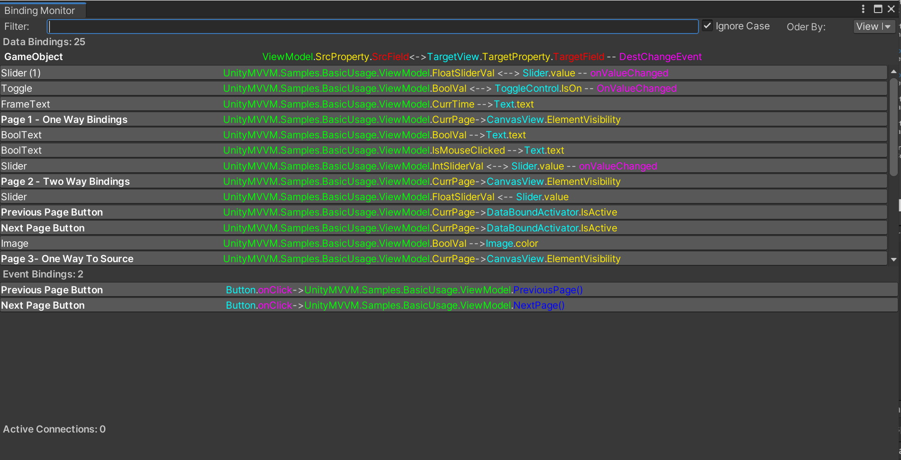

# Binding Monitor

A useful utility for debugging is included. It displays all the bindings on ACTIVE gameobjects in the scene. It can be accessed from the menu bar `Unity-MVVM`/`BindingMonitor`.

It is possible to filter the results by typing into the filter bar. It is also possible to sort the results by `ViewModel` or by `GameObject`.

Each entry is a button which displays the owner `GameObject` and the parameters of the binding. It shows the `ViewModel`, the bound `Property`, the binding type, the destination `View` and `Property`, and (if applicable) `Fields` and `DestinationChangedEvent`. When you click on an entry, the selected  `GameObject` is selected in the project heirarchy. This makes it easy to keep track of which bindings are in your scene.

The binding type is represented by the arrows betwee the ViewModel Property and the View Property. The representation is:

`-->` : OneWay

`<-->` : TwoWay

`<--` : OneWayToSource

In addition, if you have this window open during play mode, you will see currently bound bindings.

Below is an example of what the editor window looks like:

